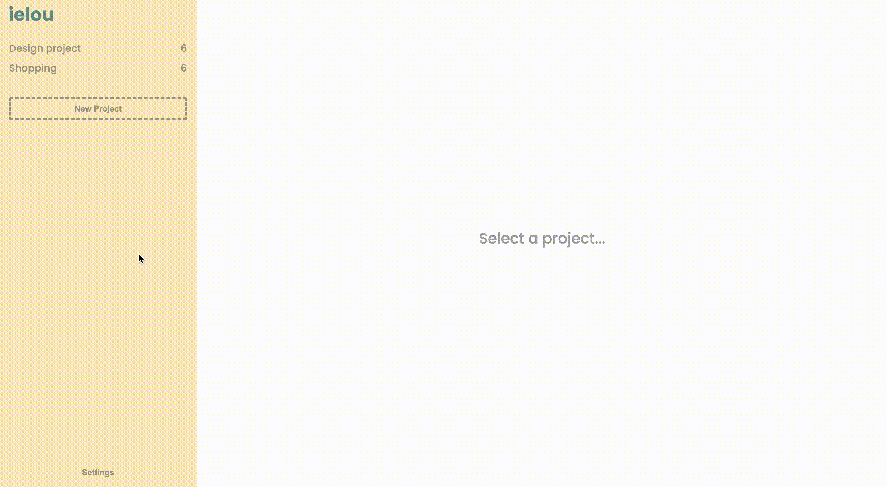

# ielou
A simple sticky notes webapp where you can create notes and organize them in projects.

> 📦 Try it out here: [ielou](https://ielou.netlify.app/)

### 🦄 The Project
I wanted to learn Typescript, so i thought the best way to do it would be to just start a small project where i could use it.

At first i thought about a todo list app, but then i saw some post-its laying around and i got the idea for this small webapp.

### ✅ Features
- Use local storage to save / load data
- Create projects
  - Edit project title and description
  - Delete project
- Create notes
  - Edit note content
  - Pin a note
  - Delete a note
- Import / Export data as JSON
- Reset data
- Light and Dark mode

---

📩 Let me know what you think about it, if you find any issues or if you have ideas on how to improve it...

